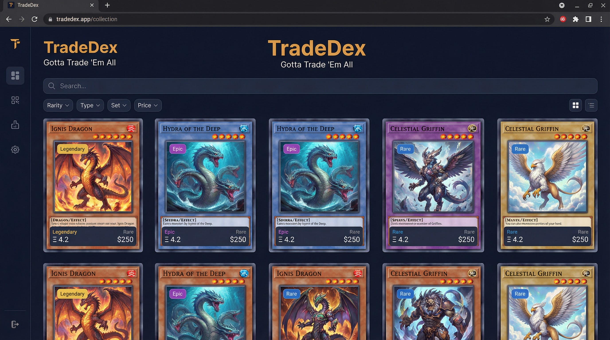

# Gotta Trade 'Em All (TradeDex)

A React-based trading game inspired by collectible monster card mechanics. Build your collection, add cards from the catalog, and trade to complete your set.

[](https://github.com/NickTheDevOpsGuy/gotta-trade-em-all/actions)
[](https://vercel.com/new/clone?repository-url=https://github.com/NickTheDevOpsGuy/gotta-trade-em-all)

> **Try it:** [Live demo](https://gotta-trade-em-all.vercel.app) *(update this URL after deploying)*
>
> **Custom domain:** In Vercel → Project Settings → Domains, add your domain (e.g. `tradedex.yourdomain.com`).
>
> **Screenshot:** 

**SEO:** `frontend/public/robots.txt` and `sitemap.xml` use the default Vercel URL. Update the Sitemap URL in `robots.txt` and the `<loc>` in `sitemap.xml` if you use a custom domain.

**Dependency updates:** Renovate (`renovate.json`) is configured. Install the [Renovate app](https://github.com/apps/renovate) on the repo.

## Features

- **Card catalog** — Browse all cards with search, filter by rarity, and sort
- **Add to collection** — One-click add any card from the catalog to your inventory
- **Trade cards** — Select cards and trade for new ones based on value (rate limited)
- **Quantity tracking** — Duplicate cards tracked; trade or add more to grow your collection
- **Export/Import** — Download collection as JSON; import from previous exports
- **Trade history** — View your recent trades
- **Themes** — Dark, light, and high-contrast modes
- **PWA** — Install as app; works offline for catalog

## Tech Stack

| Layer    | Tech                     |
| -------- | ------------------------ |
| Frontend | React 18, TypeScript, Vite |
| Backend  | Node.js, Express, TypeScript (dev) / Vercel Serverless (prod) |
| Database | SQLite (local dev) / Supabase PostgreSQL (deployed) |

## Quick Start

### Prerequisites

- Node.js 18+ (or use `nvm use` with the included `.nvmrc`)
- npm

### Installation

```bash
# Clone the repo
git clone https://github.com/NickTheDevOpsGuy/gotta-trade-em-all.git
cd gotta-trade-em-all

# Install dependencies (from project root)
npm install
```

### Development

Run both frontend and backend together:

```bash
npm run dev
```

Or run them separately:

```bash
# Terminal 1 — Backend API (port 3001)
npm run dev:backend

# Terminal 2 — Frontend (port 5173)
npm run dev:frontend
```

Open [http://localhost:5173](http://localhost:5173) in your browser.

### Production Build

```bash
npm run build
```

This builds:
- **Backend** → `backend/dist/`
- **Frontend** → `frontend/dist/`

Run the backend:

```bash
cd backend && npm start
```

Serve the frontend `dist/` with any static file server (e.g. `npx serve frontend/dist`).

### Lint & Format

```bash
npm run lint        # Lint all workspaces
npm run lint:fix    # Auto-fix lint issues
npm run format      # Format code with Prettier
npm run format:check # Verify formatting (CI)
```

### Tests

```bash
npm run test        # Unit tests (Vitest)
npm run test:e2e    # E2E tests (Playwright; requires dev server + .env with Supabase vars)
cd frontend && npm run build && npm run preview   # Then: npm run lighthouse (Lighthouse audit)
```

## Project Structure

```
gotta-trade-em-all/
├── api/                    # Vercel serverless functions (production)
│   ├── cards.ts
│   ├── inventory/
│   │   ├── index.ts
│   │   └── trade.ts
│   └── lib/supabase.ts
├── backend/                 # Express + SQLite (local dev only)
│   ├── db/schema.sql
│   └── src/
├── frontend/
│   ├── src/
│   │   ├── App.tsx
│   │   ├── contexts/AuthContext.tsx
│   │   ├── lib/supabase.ts
│   │   └── components/
│   └── index.html
├── supabase/migrations/     # PostgreSQL schema for Supabase
├── vercel.json
├── docs/
└── .github/workflows/
```

## Deploy to Vercel + Supabase

### 1. Create a Supabase project

1. Go to [supabase.com](https://supabase.com) and create a project.
2. In **Authentication** → **Providers**, enable **Anonymous Sign-In**.
3. Run the migrations in order in the Supabase SQL Editor:
   - `supabase/migrations/20250216000000_initial.sql`
   - `supabase/migrations/20250217000000_more_cards.sql`
   - `supabase/migrations/20250217100000_trade_history.sql`
4. Copy your project URL and keys from **Settings** → **API**.

### 2. Deploy to Vercel

1. Push your repo to GitHub and import it in [vercel.com](https://vercel.com).
2. Add environment variables in your Vercel project:
   - `SUPABASE_URL` — Supabase project URL
   - `SUPABASE_SERVICE_ROLE_KEY` — Supabase service role key (secret)
   - `VITE_SUPABASE_URL` — same as SUPABASE_URL (used at build time)
   - `VITE_SUPABASE_ANON_KEY` — Supabase anon/public key
3. Deploy. Vercel will build the frontend and deploy the API routes.

### 3. Local development with Supabase

```bash
# Install dependencies
npm install

# Copy env and fill in Supabase values
cp .env.example .env.local

# Run with Vercel dev (uses serverless API + Supabase)
npx vercel dev
```

Or use the original SQLite backend:

```bash
npm run dev   # Express backend + frontend
```

## API Reference

See [docs/API.md](docs/API.md) for full API documentation.

| Method | Endpoint           | Description                |
| ------ | ------------------ | -------------------------- |
| GET    | `/api/cards`       | List all cards in catalog  |
| GET    | `/api/inventory`   | List your collection       |
| POST   | `/api/inventory`   | Add a card to collection   |
| POST   | `/api/inventory/import` | Bulk import cards     |
| POST   | `/api/inventory/trade` | Trade cards for new ones |
| GET    | `/api/trades`      | Recent trade history       |
| GET    | `/api/leaderboard` | Top collectors             |
| GET    | `/api/health`      | Health check               |

## Documentation

- [API Reference](docs/API.md) — Endpoints and request/response formats
- [Architecture](docs/ARCHITECTURE.md) — System design and data flow
- [Contributing](docs/CONTRIBUTING.md) — How to contribute
- [Database Schema](docs/DATABASE.md) — Tables and relationships

## License

MIT
